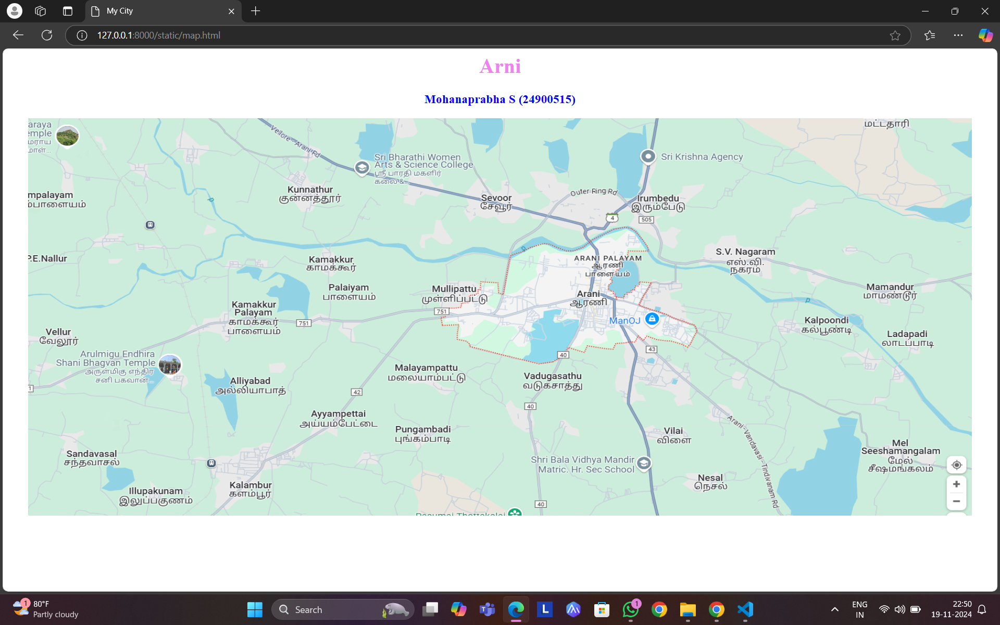
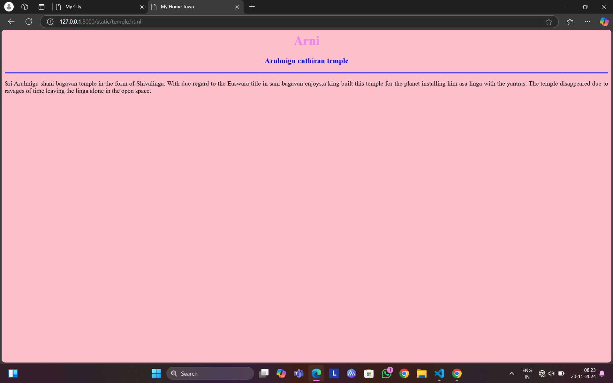
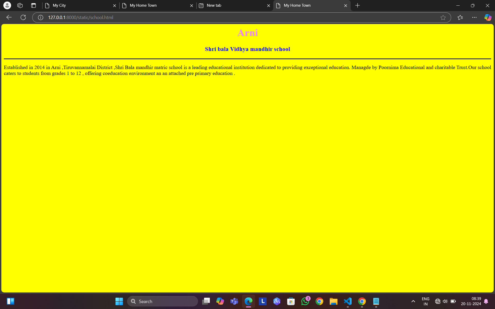
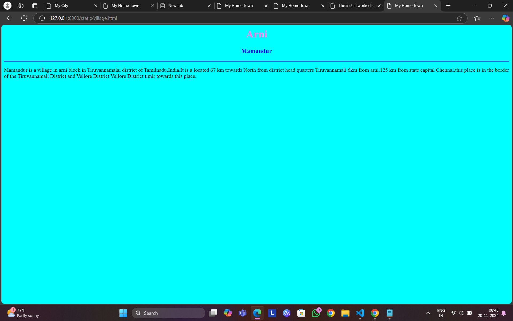
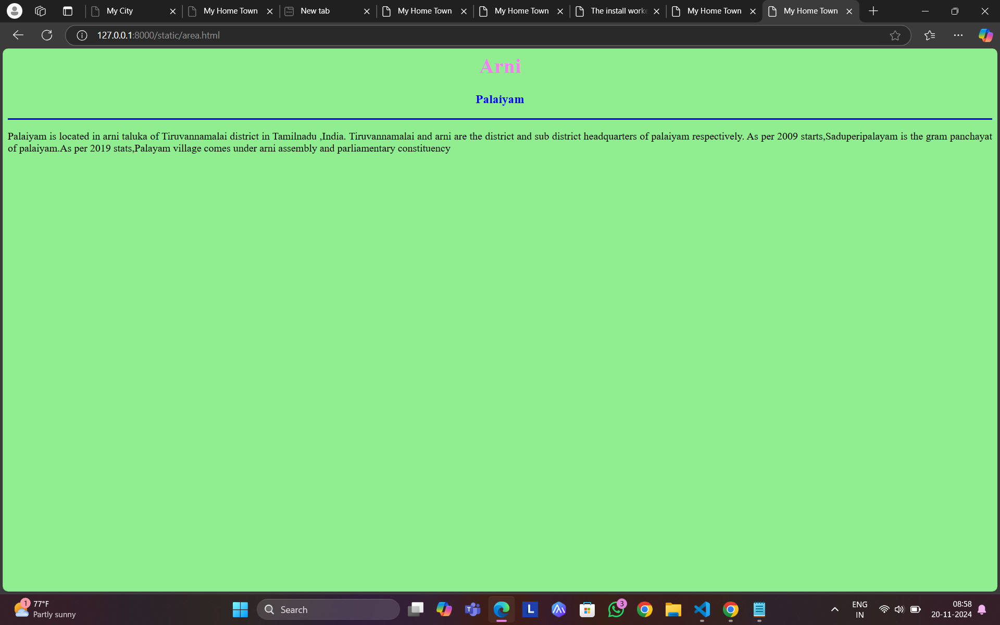
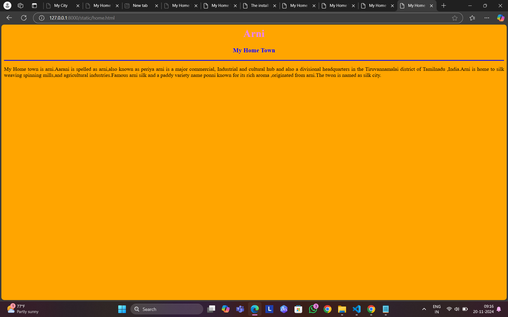

# Ex04 Places Around Me
## Date: 22.11.2024

## AIM
To develop a website to display details about the places around my house.

## DESIGN STEPS

### STEP 1
Create a Django admin interface.

### STEP 2
Download your city map from Google.

### STEP 3
Using ```<map>``` tag name the map.

### STEP 4
Create clickable regions in the image using ```<area>``` tag.

### STEP 5
Write HTML programs for all the regions identified.

### STEP 6
Execute the programs and publish them.

## CODE
```
map.html
<html>
<head>
<title>My City</title>
</head>
<body>
<h1 align="center">
<font color="violet"><b>Arni</b></font>    
</h1>
<h3 align="center">
<font color="blue"><b>Mohanaprabha S (24900515)</b></font>    
</h3>
<center>

<map name="MyCity">
<area target="" alt="Home Town" title="Home Town" href="home.html" coords="1017,286,1179,415" shape="rect">
    <area target="" alt="school" title="school" href="school.html" coords="1174,670,108" shape="circle">
    <area target="" alt="temple" title="temple" href="temple.html" coords="156,384,381,465,207,543" shape="poly">
    <area target="" alt="village" title="village" href="village.html" coords="1654,294,155" shape="circle">
    <area target="" alt="palaiyam" title="palaiyam" href="area.html" coords="536,303,688,385" shape="rect">
</map>    
</center>
</body>
</html> 

temple.html
<html>
<head>
<title>My Home Town</title>
</head>
<body bgcolor="pink">
<h1 align="center">
<font color="violet"><b>Arni</b></font>    
</h1>
<h3 align="center">
<font color="blue"><b>Arulmigu enthiran temple</b></font>    
</h3>
<hr size="3" color="blue">
<p align="justify">
<front face="Georgia" size="S">
Sri Arulmigu shani bagavan temple in the form of Shivalinga. 
With due regard to the Easwara title in sani bagavan enjoys,a king built this temple for the planet installing him asa linga with the yantras.
The temple disappeared due to ravages of time leaving the linga alone in the open space.
<p>
</body>
</html>

village.html
<html>
<head>
<title>My Home Town</title>
</head>
<body bgcolor="cyan">
<h1 align="center">
<font color="violet"><b>Arni</b></font>    
</h1>
<h3 align="center">
<font color="blue"><b>Mamandur</b></font>    
</h3>
<hr size="3" color="blue">
<p align="justify">
<front face="Georgia" size="S">
Mamandur is a village in arni block in Tiruvannamalai district of Tamilnadu,India.It is a located 67 km towards North from district
head quarters Tiruvannamali.6km from arni.125 km from state capital Chennai.this place is in the border of the Tiruvannamali
District and Vellore District.Vellore District timir towards this place.  
<p>
</body>
</html>

school.html
<html>
<head>
<title>My Home Town</title>
</head>
<body bgcolor="yellow">
<h1 align="center">
<font color="violet"><b>Arni</b></font>    
</h1>
<h3 align="center">
<font color="blue"><b>Shri bala Vidhya mandhir school</b></font>    
</h3>
<hr size="3" color="blue">
<p align="justify">
<front face="Georgia" size="S">
Established in 2014 in Arni ,Tiruvannamalai District ,Shri Bala mandhir matric school is a leading educational institution dedicated
to providing exceptional education. Managde by Poornima Educational and charitable Trust.Our school caters to students from grades 1 to 12 ,
offering coeducation environment an an attached pre primary education .
<p>
</body>
</html>

home.html
<html>
<head>
<title>My Home Town</title>
</head>
<body bgcolor="orange">
<h1 align="center">
<font color="violet"><b>Arni</b></font>    
</h1>
<h3 align="center">
<font color="blue"><b>My Home Town </b></font>    
</h3>
<hr size="3" color="blue">
<p align="justify">
<front face="Georgia" size="S">
My Home town is arni.Aarani is spelled as arni,also known as periya arni is a major commercial,
Industrial and cultural hub and also a divisional headquarters in the Tiruvannamalai district of
Tamilnadu ,India.Arni is home to silk weaving spinning mills,and agricultural industries.Famous arni
silk and a paddy variety name ponni known for its rich aroma ,originated from arni.The twon is named as silk city.
<p>
</body>
</html>

area.html
<html>
<head>
<title>My Home Town</title>
</head>
<body bgcolor="lightgreen">
<h1 align="center">
<font color="violet"><b>Arni</b></font>    
</h1>
<h3 align="center">
<font color="blue"><b>Palaiyam</b></font>    
</h3>
<hr size="3" color="blue">
<p align="justify">
<front face="Georgia" size="S">
Palaiyam is located in arni taluka of Tiruvannamalai district in Tamilnadu ,India.
Tiruvannamalai and arni are the district and sub district headquarters of palaiyam respectively.
As per 2009 starts,Saduperipalayam is the gram panchayat of palaiyam.As per 2019 stats,Palayam village comes under arni assembly 
and parliamentary constituency.
<p>
</body>
</html>

```

## OUTPUT








## RESULT
The program for implementing image maps using HTML is executed successfully.
